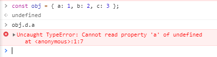

# 깊은 객체 탐사 방법
## 개요
Javascript 개발자들은 아래와 같은 상황을 많이 보았을 것이다.



물론 이게 좀 극단적으로 보일 수는 있는데, 객체 내부의 객체의 아이템을 탐색하는 경우는 정말 흔한 일이다.
그런데 어지간하면 API에서 오는 데이터들을 보고 개발자가 개발을 했을테니 깨지는 일이 없겠지만, 간혹 가다가 Response structure가 변경되거나, 네트워크 자체가 응답이 없어서 프로그램 작성 당시와는 다른 결과를 내뱉는 경우가 있다.

그래서 개발을 할 때 보통
```
if (obj.a) return obj.a.b;
```
와 같은 조치를 취하는데, 이게 또 객체가 깊어질수록 if문도 같이 늘어나는 문제가 생긴다. 그렇게 방안을 알아보다 알아낸 방법이 있다.

## 해결 방법
```
return obj.a?.b;
```
를 하면 된다. 물음표 연산자가 앞의 obj가 있는지 식별하고, 없으면 undefined, 있다면 ```obj.a.b``` 의 값을 return해준다.

극단적으로 하자면 이렇게도 가능하다.
```
return obj.a?.b?.c?.d;
```