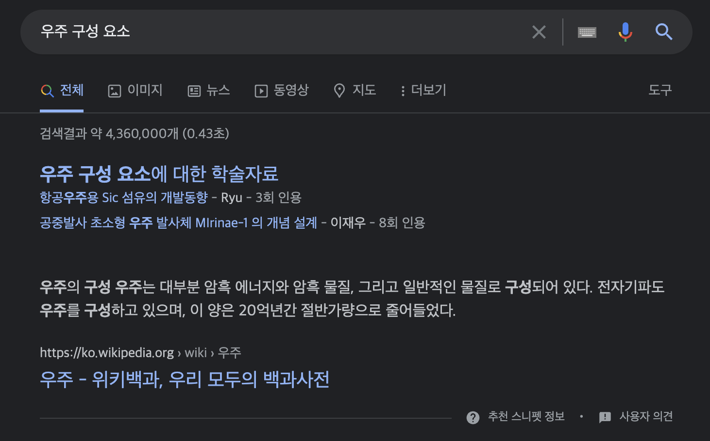

# 시멘틱 태그의 사용
## 개요
**Sementic**은 구글에 검색했을 때 **의미의 / 의미적인**이라는 뜻을 가진 영어단어라고 나온다. 다시 말해 시멘틱 태그는 **의미가 있는 태그** 정도로 해석할 수 있다.
그렇다면 태그에 의미가 있다는건 어떤걸까?

본래 예전부터 통용되던 웹은 아래와 같은 구조를 갖고 있었다.


그런데 시멘틱 웹은 실제 레이아웃 구조를 태그에 나타내는 형태의 웹을 말한다.


## 문제점
그렇다면 기존의 웹 처럼 ```<div>```로 이루어진 웹을 탐색하면 무슨 문제점이 있길래 시멘틱 태그라는걸 굳이 만든걸까?
### 웹 접근성
가장 대표적인 문제점은 시멘틱 태그를 사용하지 않으면 **눈을 쓸 수 있는 대상만** 웹을 이용할 수 있게 된다.

이게 도대체 무슨 소리인가 싶을텐데, **세상에는 눈이 보이는 사람만 있는게 아니다.** 태어날 때부터 혹은 자라면서 눈이 안보이게 되는 사람들이 있고 나이가 들어 시력이 떨어지면서 정상적으로 웹을 이용하기 힘든 사람이 있을 수 있다. 그런 사람들은 **스크린 리더** 라는 프로그램(혹은 제품)을 사용하는데, 이 제품은 **사용자가 화면에서 선택한 요소가 무엇인지 소리를 내어 읽어준다.**

**스크린 리더**는 선택 된 요소가 무엇인지를 식별하기 위해 웹을 구성하는 코드를 읽어서 해당 요소가 무엇인지 판별한다. 선택된 요소가 만약 ```<div class="ha-01 h-03 zhrSgaeg">안녕</div>``` 같은 요소라면 **스크린 리더**가 해당 요소가 하는 역할을 정확히 해석하여 전달하기 어려울 것이다.

반면 시멘틱 태그로 UI를 구성할 경우
```html
  <header>
    <nav>
      <ul>
        <li>Menu 01</li>
        <li>Menu 02</li>
        <li>Menu 03</li>
        <li>Menu 04</li>
      </ul>
    </nav>
  </header>
```
사이트의 정체성을 나타내는 영역인 **header**와 다른 페이지로 이동할 수 있게 하는 네비게이션인 **nav**를 쉽게 판별하여 사용자에게 알려줄 수 있다.
### SEO
당연한 소리겠지만 검색 크롤러 봇은 **눈이 없다.** 우리처럼 눈으로 사이트의 구조를 보고 어디에 어떤 요소가 있는지를 찾기가 힘들다는 얘기이다. 그렇다면 크롤러 봇도 마찬가지로 코드를 해석하여 사이트를 탐색한다는 얘기인데, 우리가 구글에 궁금한 점을 검색하다보면 가끔 일반적인 검색요소와 달리 이렇게 결과가 나오는걸 볼 수 있다.



우리가 원하는 내용을 장황하게 적힌 본문 안에서 찾아서 바로 요약해주는 기능이다. 물론 이건 구글이 탐색 알고리즘을 정말 잘 짠 것이겠지만, 웹사이트의 구조 자체가 해당 알고리즘을 받아들이도록 의미적이게 작성 되어서 가능한 일이다.
### 개발자들의 퇴근을 위해서
혹시 다른 웹 개발자가 짠 장황한 HTML 파일을 본 적 있는가? ```class```나 ```id```를 통해 해당 요소의 역할을 제대로 적어놨다면 모르겠는데, ```class```나 ```id``` 등의 ```attribute```를 단순히 ```CSS```나 ```Javascript```에서 객체를 선택하기 위한 수단으로만 활용하는 개발자들이 더러 있다. 그런데 그런 개발자들이 태그마저 ```<div>```로 통일하여 작업했다면 정말 환장할 노릇이다. 헤더가 뭐고 푸터가 뭔지 알아보는데 시간을 상당량 사용하게 된다.

그런 상황에서 ```<header>``` ```<footer>``` ```<section>``` ```<aside>``` 등의 의미 있는 태그로 구성해놨다면 ```class``` 이름이 아무리 인간친화적이지 않다고 하더라도 코드를 탐색하는 시간을 현저하게 줄일 수 있을 것이다.
## 후기
물론 나도 시멘틱 태그의 존재는 고등학생 때부터 알고 있었고, 웹 개발을 할 때 시멘틱 태그를 작성하면 좋다는 것을 이미 알고 있었다. 그런데 막상 현업에 나와서 개발할 때는 ```.header```로 웹을 작성하고 있는 나를 발견할 수 있었다.

그리고 생각보다 시멘틱 태그의 종류가 다양하다는 것을 알게 되었다. 앞으로 웹을 개발할 때는 **내가 아닌 다른 사람도 쓸 수 있는** 좋은 웹을 만들어야겠다는 생각이 들었다.
