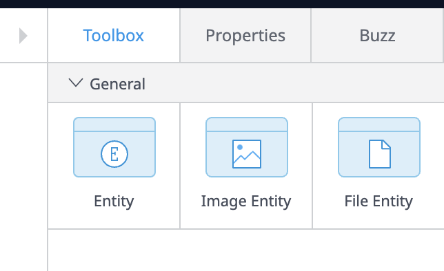

# Mendix 개발 시작하기
## Dashboard 접속하는 방법
[여기](https://home.mendix.com)에 접속합니다. (만약 로그인이 되어있지 않다면 **로그인**합니다.)  

우측 상단 **[Create App]** 버튼을 누릅니다.  

**[Blank Web App]** 버튼을 누릅니다.  

우측 하단에 있는 **[Select This Template]** 버튼을 누릅니다.  

로딩이 시작됩니다. **(이 과정에서 오래 걸릴 수 있습니다.)**  
로딩이 완료되고 만들어진 프로젝트에 접속합니다.

우측 상단에 **[Edit in Studio]** 버튼을 누릅니다.  

아래와 같은 Dashboard가 나옵니다.  

## Page 제작 방법
좌측 메뉴에서 두번째 아이콘을 누릅니다.  

우측 상단 + 버튼을 누릅니다.  

원하는 페이지 템플릿을 선택, 페이지 이름을 작성하고 **우측 하단 [Create] 버튼**을 누릅니다.
> 페이지 이름은 일반적인 프로그래밍 언어의 클래스명과 같아서 **띄어쓰기가 허용되지 않습니다.**

## Domain Model 등록 방법
좌측 메뉴에서 **4번째 아이콘**을 누릅니다.  

기본적으로 존재하는 **Domain Model을 선택해줍니다.**  

존재하는 도메인 타입 중 상황에 맞는 도메인 타입을 선택하여 화면에 **Drag and Drop** 합니다.  

**Domain Model**의 이름을 입력하고 **[Create] 버튼을 누릅니다.**  

