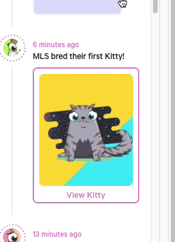

# Confetti
## 개요
Javascript canvas를 이용하여 웹사이트에 색종이를 뿌려주는 라이브러리이다.

도대체 이걸 왜 써야하나 싶겠지만, 사용자에게 즐거운 기분을 주기 위해 사용한다. 예를 들자면 이렇게!


## 설치
### CDN
```html
<script src="https://cdn.jsdelivr.net/npm/canvas-confetti@1.4.0/dist/confetti.browser.min.js"></script>
```
### NPM
```
npm install --save canvas-confetti
```
### Yarn
```
yarn add canvas-confetti
```
## 사용법
### Basic
```javascript
var myCanvas = document.createElement('canvas');
document.appendChild(myCanvas);

var myConfetti = confetti.create(myCanvas, {
  resize: true,
  useWorker: true
});
myConfetti({
  particleCount: 100,
  spread: 160
  // any other options from the global
  // confetti function
});
```
### 심화 예제
```javascript
  const { x, y } = event;
  const { offsetWidth: ow, offsetHeight: oh } = event.target;
  const { width: ww, height: wh } = window.screen;
  const originX = x / ww;
  const originY = ((y + oh) / wh);
  const canvas = document.createElement('canvas');
  canvas.classList.add('confetti-canvas');
  document.body.appendChild(canvas);
  const confetti = window.confetti.create(canvas, { resize: true });
  confetti({
    particleCount: 450,
    shapes: ['circle'],
    origin: { x: originX, y: originY },
    spread: 360,
    gravity: 0,
    startVelocity: 15,
    ticks: 40,
  });
  setTimeout(() => {
    confetti.reset();
  }, 4000);
```
### Options
- particleCount Integer (default: 50): The number of confetti to launch. More is always fun... but be cool, there's a lot of math involved.
- angle Number (default: 90): The angle in which to launch the confetti, in degrees. 90 is straight up.
- spread Number (default: 45): How far off center the confetti can go, in degrees. 45 means the confetti will launch at the defined angle plus or minus 22.5 degrees.
- startVelocity Number (default: 45): How fast the confetti will start going, in pixels.
- decay Number (default: 0.9): How quickly the confetti will lose speed. Keep this number between 0 and 1, otherwise the confetti will gain speed. Better yet, just never change it.
- gravity Number (default: 1): How quickly the particles are pulled down. 1 is full gravity, 0.5 is half gravity, etc., but there are no limits. You can even make particles go up if you'd like.
- drift Number (default: 0): How much to the side the confetti will drift. The default is 0, meaning that they will fall straight down. Use a negative number for left and positive number for - right.
- ticks Number (default: 200): How many times the confetti will move. This is abstract... but play with it if the confetti disappear too quickly for you.
- origin Object: Where to start firing confetti from. Feel free to launch off-screen if you'd like.
- origin.x Number (default: 0.5): The x position on the page, with 0 being the left edge and 1 being the right edge.
- origin.y Number (default: 0.5): The y position on the page, with 0 being the top edge and 1 being the bottom edge.
- colors Array<String>: An array of color strings, in the HEX format... you know, like #bada55.
- shapes Array<String>: An array of shapes for the confetti. The possible values are square and circle. The default is to use both shapes in an even mix. You can even change the mix by providing a value such as ['circle', 'circle', 'square'] to use two third circles and one third squares.
- scalar Number (default: 1): Scale factor for each confetti particle. Use decimals to make the confetti smaller. Go on, try teeny tiny confetti, they are adorable!
- zIndex Integer (default: 100): The confetti should be on top, after all. But if you have a crazy high page, you can set it even higher.
- disableForReducedMotion Boolean (default: false): Disables confetti entirely for users that prefer reduced motion. The confetti() promise will resolve immediately in this case.