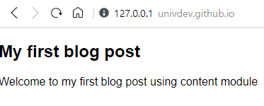

# Git Pages를 NuxtJS로 구축하기
## 개요
Github는 모든 회원들에게 무료로 블로그를 구축할 수 있는 솔루션을 제공하고 있다. 이 문서에서 소개할 Github Pages라는 솔루션이다.
구축 방법은 매우 간단한데, Github에 ```{username}.gitgub.io``` 혹은 ```{username}.github.com``` 이라는 이름으로 레포를 만들면 해당 레포 안에 들어있는 내용을 토대로 구축이 가능하다.
Github Pages는 ```HTML``` ```CSS``` ```JS``` 세 가지 언어를 모두 지원하기 때문에 유연한 블로그를 구축할 수 있다.

이 문서에서는 NuxtJS를 통해 Github Pages를 구축하는 방법을 정리해보겠다.
## 방법
### npx를 통한 NuxtJS 프로젝트 설치
```
npx create-nuxt-app {username}.github.io
```
프로젝트 생성
### Git 연동
```
cd {username}.github.io
git remote add origin https://github.com/{username}/{username}.github.io
```
### Content Module 설치
```
yarn add @nuxtjs/content
```
### Content 폴더 생성
```
mkdir content
```
### Page 생성
```
mkdir pages/blog
touch pages/blog/_slug.vue
```
### _slug.md
```vue
<template>
  <article>
    <nuxt-content :document="article" />
  </article>
</template>

<script>
  export default {
    async asyncData({ $content, params }) {
      const article = await $content('articles', params.slug).fetch()

      return { article }
    }
  }
</script>
```
### my_first_blog_page.md
```markdown
# My first blog post

Welcome to my first blog post using content module
```
### /blog/my_first_blog_page 접속
