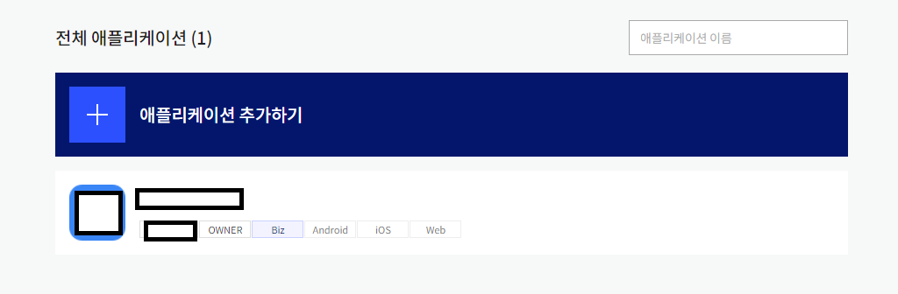

# Kakaotalk 공유
> 이 문서에 기재할 내용은 카카오톡 링크 공유에 관련한 내용입니다.
## 방법
### 카카오 개발자에 로그인
- [카카오 개발자](https://developers.kakao.com/)에 접속한다.
- 로그인한다.
### 내 애플리케이션에 접속한다.
- [카카오 개발자 어플리케이션 목록](https://developers.kakao.com/console/app)에 접속한다.
- 프로젝트가 없다면 *어플리케이션 추가하기* 버튼을 눌러 어플리케이션을 추가한다.
- 있다면 아래 사진과 같이 나오는 목록에서 해당 어플리케이션을 클릭한다.


### 요약정보에 접속한다.
- 좌측 탭에서 '요약정보'를 눌러 접속한다.
- ```JavaScript 키```를 복사하여 보관한다.
### 프로젝트에 Kakao API CDN을 첨부한다.
- ```https://developers.kakao.com/sdk/js/kakao.min.js```을 추가한다.
### window.Kakao 객체가 정의 되었는지 확인한다.
- 프로젝트에 접속하여 개발자도구 콘솔창에서 ```window.Kakao```를 쳐서 ```undefined```가 나오진 않는지 확인한다.
### 직접 만든 공유하기 버튼을 사용할 경우
index.html
```html
  <button type="button" onclick="kakaoShare">
```
common.js
```javascript
const kakaoShare = () => {
  window.Kakao.Link.sendDefault({
    objectType: 'feed',
    content: {
      title: '디저트 사진',
      description: '아메리카노, 빵, 케익',
      imageUrl:
        'http://mud-kage.kakao.co.kr/dn/NTmhS/btqfEUdFAUf/FjKzkZsnoeE4o19klTOVI1/openlink_640x640s.jpg',
      link: {
        mobileWebUrl: 'https://developers.kakao.com',
        androidExecutionParams: 'test',
      },
    },
    social: {
      likeCount: 10,
      commentCount: 20,
      sharedCount: 30,
    },
    buttons: [
      {
        title: '웹으로 이동',
        link: {
          mobileWebUrl: 'https://developers.kakao.com',
        },
      },
      {
        title: '앱으로 이동',
        link: {
          mobileWebUrl: 'https://developers.kakao.com',
        },
      },
    ]
  });
};
```
### 카카오톡에서 지원하는 기본 버튼을 사용할 경우
index.html
```html
  <div id="CONTAINER_ID"></div>
```
common.js
```javascript
  Kakao.Link.createDefaultButton({
    container: '#CONTAINER_ID',
    objectType: 'feed',
    content: {
      title: '디저트 사진',
      description: '아메리카노, 빵, 케익',
      imageUrl:
        'http://mud-kage.kakao.co.kr/dn/NTmhS/btqfEUdFAUf/FjKzkZsnoeE4o19klTOVI1/openlink_640x640s.jpg',
      link: {
        mobileWebUrl: 'https://developers.kakao.com',
        androidExecutionParams: 'test',
      },
    },
    social: {
      likeCount: 10,
      commentCount: 20,
      sharedCount: 30,
    },
    buttons: [
      {
        title: '웹으로 이동',
        link: {
          mobileWebUrl: 'https://developers.kakao.com',
        },
      },
      {
        title: '앱으로 이동',
        link: {
          mobileWebUrl: 'https://developers.kakao.com',
        },
      },
    ]
  });
```